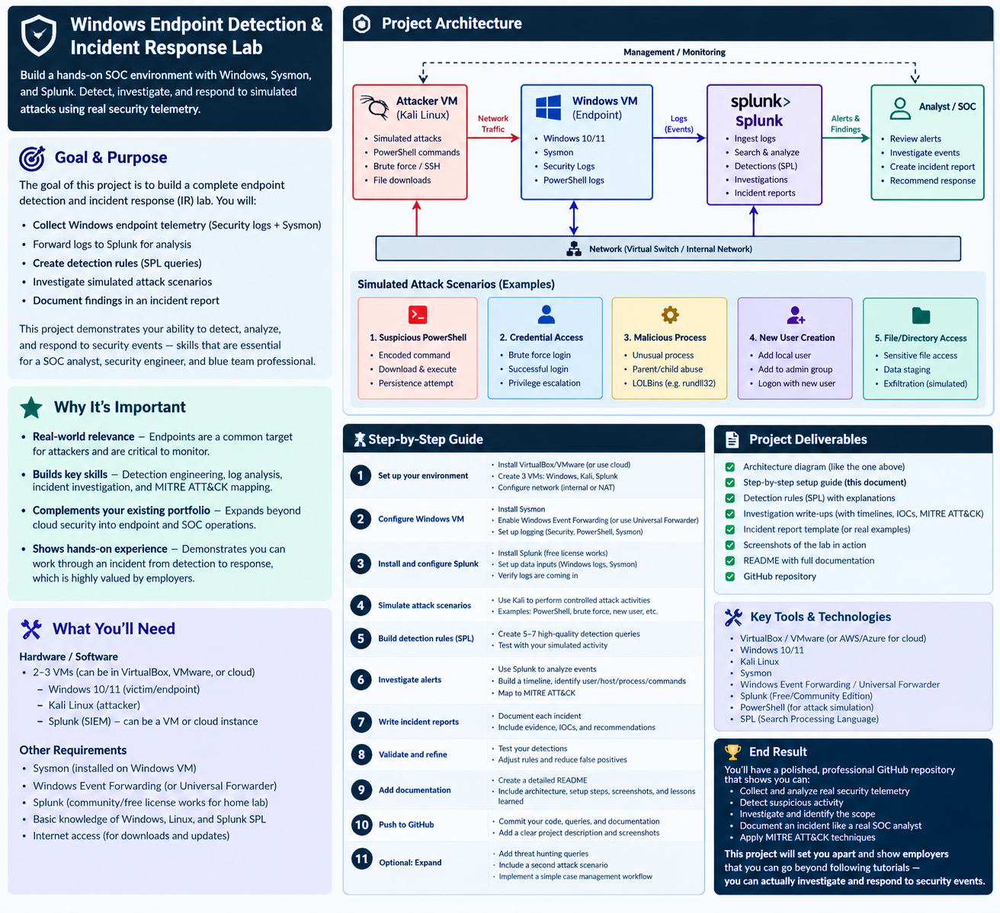

# 🛡️ Windows Endpoint Detection & Incident Response Lab

A hands-on SOC environment built from scratch: Windows telemetry, Sysmon,
Splunk, and five simulated attack scenarios, each taken through the full
cycle of **generate → collect → detect → investigate → document**.

This project goes beyond installing a SIEM and writing searches. It
demonstrates the ability to build a controlled environment, generate
realistic suspicious activity, collect the right endpoint telemetry,
detect that activity, investigate what happened, and produce an incident
report the way a SOC analyst would.

## Architecture



Splunk runs on the host machine. The Windows VM (`WIN-LAB-01`,
`192.168.56.10`) and Kali VM (`192.168.56.20`) sit on an isolated
host-only network, with only SMB (445) and ICMP exposed between them —
see [`docs/lessons-learned.md`](docs/lessons-learned.md) for why that
narrow exposure became a finding in its own right.

## What This Demonstrates

| Domain | Skill |
|---|---|
| Endpoint Security | Understanding Windows and Sysmon telemetry |
| SIEM | Ingesting and searching security logs at scale |
| Detection Engineering | Turning suspicious behavior into tuned, tested SPL detections |
| Threat Hunting | Investigating beyond the original alert |
| Incident Response | Building a timeline and determining what happened |
| MITRE ATT&CK | Mapping observed activity to attacker techniques, and explaining why |
| Documentation | Communicating findings clearly, including failures and iterations |
| Troubleshooting | Diagnosing real problems in a security environment (permissions, networking, firewall) |

## Scenarios & Detections

Five scenarios were built, each generating real telemetry on a live lab
host, then detected and investigated.

| # | Scenario | MITRE ATT&CK | Detection | Full Report |
|---|---|---|---|---|
| 1 | Brute-force authentication (4625 → 4624) | T1110, T1110.001, T1078 | [`detections/failed-login-success.md`](detections/failed-login-success.md) | [`investigations/INC-001-brute-force.md`](investigations/INC-001-brute-force.md) |
| 2 | Encoded/obfuscated PowerShell execution | T1059.001, T1027 | [`detections/encoded-powershell.md`](detections/encoded-powershell.md) | — |
| 3 | New local account + privilege escalation | T1136.001, T1098 | [`detections/new-user.md`](detections/new-user.md), [`detections/privileged-group-change.md`](detections/privileged-group-change.md) | — |
| 4 | Binary masquerading + suspicious parent/child process | T1036, T1036.003, T1059.001 | [`detections/suspicious-process.md`](detections/suspicious-process.md) | [`investigations/INC-002-masquerading-parentchild.md`](investigations/INC-002-masquerading-parentchild.md) |
| 5 | Persistence via scheduled task | T1053.005 | [`detections/scheduled-task.md`](detections/scheduled-task.md) | — |

Full technique list and rationale: [`mitre/attack-mapping.md`](mitre/attack-mapping.md)

## Repository Structure

```
windows-endpoint-detection-ir/
│
├── README.md
│
├── architecture/
│   └── architecture.png
│
├── detections/
│   ├── failed-login-success.md
│   ├── encoded-powershell.md
│   ├── new-user.md
│   ├── privileged-group-change.md
│   ├── suspicious-process.md
│   └── scheduled-task.md
│
├── spl/
│   ├── authentication.spl
│   ├── powershell.spl
│   ├── process_creation.spl
│   └── persistence.spl
│
├── investigations/
│   ├── INC-001-brute-force.md
│   └── INC-002-masquerading-parentchild.md
│
├── screenshots/
│   └── (numbered screenshots referenced throughout the detection
│        and investigation docs)
│
├── mitre/
│   └── attack-mapping.md
│
└── docs/
    ├── setup.md
    └── lessons-learned.md
```

## Highlights Worth Reading First

If you only read three things in this repo, make them these — they show
the iterative, real-world process behind the work, not just clean
end-states:

1. **[`investigations/INC-002-masquerading-parentchild.md`](investigations/INC-002-masquerading-parentchild.md)**
   — a detection that took three tuning iterations (17 false positives →
   1 true positive) with the full root-cause analysis for each round.
2. **[`docs/lessons-learned.md`](docs/lessons-learned.md)** — real
   problems hit and fixed during the build: a Sysmon permissions issue
   that silently blocked an entire telemetry source, a Windows network
   profile quirk that blocked SMB despite a correct firewall rule, and a
   genuine detection blind spot (Sysmon's default config doesn't log
   inbound SMB traffic) discovered while validating Scenario 1.
3. **[`investigations/INC-001-brute-force.md`](investigations/INC-001-brute-force.md)**
   — includes a documented telemetry attribution limitation
   (`Source_Network_Address` not reflecting the true attacker IP for
   NTLM-authenticated logons) rather than assuming every log field is
   trustworthy at face value.

## Challenges & Fixes

Every one of these was hit for real during this build, not anticipated in
advance. Full root-cause detail for each is in
[`docs/lessons-learned.md`](docs/lessons-learned.md).

| Challenge | Root Cause | Fix |
|---|---|---|
| Sysmon events never reached Splunk, while every other log source worked fine | The forwarder's service account (`NT SERVICE\SplunkForwarder`) had no read access to the Sysmon event channel's ACL — a separate permission set from Security/System/Application logs | Added the forwarder's service SID to the Sysmon channel's ACL with `wevtutil sl ... /ca:` |
| SMB port 445 showed `filtered` despite a correct, enabled firewall rule | The host-only network adapter was classified as **Public** by Windows, which disables several default sharing rules regardless of custom rules added alongside them | Reclassified the adapter as **Private** with `Set-NetConnectionProfile` |
| Valid admin credentials authenticated over SMB, but every WMI-based remote execution method (`wmiexec`, `mmcexec`) failed with `rpc_s_access_denied` | SMB (445) and RPC/DCOM (135 + dynamic ports) are separate service surfaces; only SMB was exposed between the lab VMs | Executed payloads locally on the target VM instead — endpoint telemetry is identical either way, and it surfaced a real, documentable lateral-movement boundary |
| Event timestamps in Splunk's raw text were 2 hours off from the host | VM and host were on different Windows time zones; Splunk's internal `_time` was correct, but the embedded raw event text wasn't | Matched the VM's time zone to the Splunk host with `Set-TimeZone` |
| A masquerading detection (filename vs. compiled binary identity) produced 17 false positives on an idle VM | Some processes report `OriginalFileName` as a literal `"-"`; legitimate Microsoft installers intentionally ship with a different internal name than their public filename; some system binaries have no file extension in their metadata at all | Iterated through three versions of the query, each fixing one root cause, down to a single true positive — full before/after in [`investigations/INC-002-masquerading-parentchild.md`](investigations/INC-002-masquerading-parentchild.md) |
| The brute-force attack was only visible in one telemetry source | Sysmon's default (SwiftOnSecurity) configuration excludes common file-sharing ports from network connection logging, so Event ID 3 never captured the inbound SMB traffic | Documented as a genuine coverage gap rather than treated as solved; informs the Zeek/Suricata item in the V2 roadmap below |
| Account and host shared the same name, making early logs ambiguous to read | Accepted Windows Setup's default local account name, which matched the computer name | Created a dedicated `lab-user` account and disabled the original |

## What I'd Do Differently Next Time

- **Separate the attacker-facing account from the admin account earlier.**
  Several scenarios ended up reusing `lab-user` (an administrator) for
  actions that would more realistically come from a lower-privileged,
  already-compromised account. A dedicated mid-privilege "beachhead"
  account would make the later scenarios more realistic.
- **Open RPC/DCOM deliberately, as its own documented decision**, rather
  than discovering mid-scenario that it was closed. Either choice (open it
  for realistic lateral movement, or keep it closed and document the
  resulting boundary) is defensible — the goal next time is to decide it
  up front rather than react to it.
- **Build the masquerading detection against a wider time window from the
  start.** The first "clean" version looked solid on a 15-minute window
  and only revealed its true false-positive surface once tested against
  60 minutes of activity. Testing detections against a longer baseline
  earlier would have caught this sooner.
- **Capture every screenshot in the same session as the finding**, rather
  than batching them at the end. A few were skipped or had to be re-run
  later because the exact underlying events had aged out of the default
  search window.
- **Decide the account-naming convention before generating any telemetry**,
  not after. The account/hostname collision was a small thing to fix, but
  it would have been free to avoid entirely with five extra minutes of
  planning at the start.

## Environment

- **Windows VM:** Windows 10/11, Sysmon (SwiftOnSecurity config), full
  audit policy, PowerShell Script Block Logging, Splunk Universal
  Forwarder
- **Kali VM:** attacker/simulation host, NetExec and Impacket for
  controlled scenario generation
- **SIEM:** Splunk Enterprise (Free/Community license tier)
- **Networking:** isolated host-only lab network, NAT for internet access
  only

Full build steps, including every fix required along the way:
[`docs/setup.md`](docs/setup.md)

## Project Progression

This project is part of a broader security portfolio:

```
PROJECT 1: AWS IAM Security Audit          → Configuration Security
PROJECT 2: AWS CloudTrail Detection        → Behavioral Detection
PROJECT 3: CloudTrail + Splunk             → SIEM + Hunting + Investigation
PROJECT 4: Windows Endpoint Detection & IR → Endpoint Security, Detection
                                              Engineering, Incident
                                              Investigation, Incident
                                              Response   ← this repo
```

## Roadmap (V2)

- Zeek/Suricata for network-layer visibility (identified as a genuine gap
  during Scenario 1 — see lessons-learned)
- Active Directory integration
- Additional correlation and automated enrichment
- Expanded threat hunting beyond the original five detections
