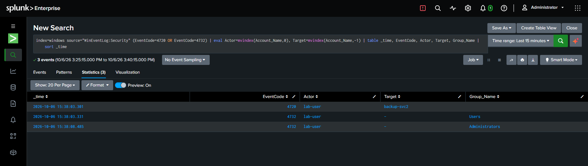
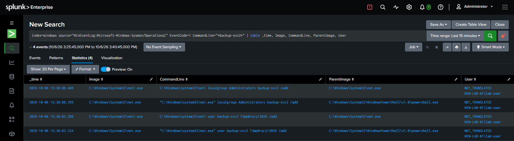
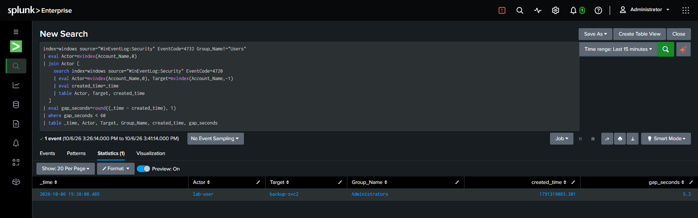

# Detection: Privileged Group Modification Following Account Creation

| Field | Value |
|---|---|
| **Name** | New Account Escalated to Privileged Group |
| **Purpose** | Detect a new local account being added to a privileged group (Administrators, Remote Desktop Users, etc.) shortly after creation — a strong persistence / privilege-escalation indicator |
| **Data source** | Security 4720 (account created), 4732 (member added to a security-enabled local group) |
| **MITRE ATT&CK** | T1136.001 (Create Account: Local Account), T1098 (Account Manipulation) |

## Detection Logic

Every new local account is automatically added to the built-in **Users**
group as part of standard account creation — this must be excluded, or the
detection is unusably noisy. The signal that matters is escalation to a
*privileged* group within a short window of creation.

```spl
index=windows source="WinEventLog:Security" EventCode=4732 Group_Name!="Users"
| eval Actor=mvindex(Account_Name,0)
| join Actor [
    search index=windows source="WinEventLog:Security" EventCode=4720
    | eval Actor=mvindex(Account_Name,0), Target=mvindex(Account_Name,-1)
    | eval created_time=_time
    | table Actor, Target, created_time
  ]
| eval gap_seconds=round((_time - created_time), 1)
| where gap_seconds < 60
| table _time, Actor, Target, Group_Name, created_time, gap_seconds
```

## Expected Result

A single row per incident: the actor, the new account name, the privileged
group it was added to, and the time elapsed between creation and
escalation. A short gap (single-digit to low double-digit seconds) is
consistent with scripted/automated attacker behavior rather than manual
administration.

## False Positives

Legitimate fast provisioning — an administrator using a script or template
to stand up a new privileged account (exactly what happened when `lab-user`
was created during this project's own setup) — produces an identical timing
pattern. Timing alone does not establish intent; the *actor's* identity and
whether the action matches expected change-management process are the
deciding factors. In a production environment, this detection is best
paired with a change-ticket/approval lookup or an allowlist of accounts
authorized to grant admin rights.

## Investigation Steps

1. Confirm the identity and authorization of the `Actor`.
2. Check whether this action corresponds to a known, approved provisioning
   event (ticket, change request, onboarding record).
3. Check the new account name for masquerading patterns (e.g., a name
   closely resembling an existing legitimate account).
4. Review what the new account did immediately after being granted
   privileges (4624 logon, 4688/Sysmon 1 process activity).

## Recommended Response

If unauthorized: disable both the new account and, if compromised, the
creating account; remove the account from the privileged group; audit all
actions taken under the new account's privileges since creation.

## Validation Notes

Legitimate baseline: `lab-user` created via `New-LocalUser` and added to
Administrators as a separate, deliberate step during initial VM setup.

Simulated incident: `backup-svc2` — an account name deliberately chosen to
resemble the legitimate `svc-backup` account (account name masquerading) —
created and escalated to Administrators via `net user` / `net localgroup`
exactly 5.2 seconds apart, confirmed independently at both the Security log
level (4720 → 4732 timing) and the Sysmon process level (`net.exe` →
`net1.exe` command pairs 5 seconds apart, same parent process and session).
The two sources corroborating the same timing gap through entirely
different telemetry paths is strong evidence of a single, deliberate,
scripted action rather than coincidental manual steps.

## Evidence


*4720/4732 events for `backup-svc2` — a name deliberately chosen to resemble the legitimate `svc-backup` account — escalated to Administrators 5.2 seconds after creation.*


*`net.exe`/`net1.exe` pairs for both the account creation and the group add, same user and session, 5 seconds apart — consistent with scripted rather than manual administration.*


*The single true-positive row, after excluding the automatic "Users" group enrollment that every new account receives.*
