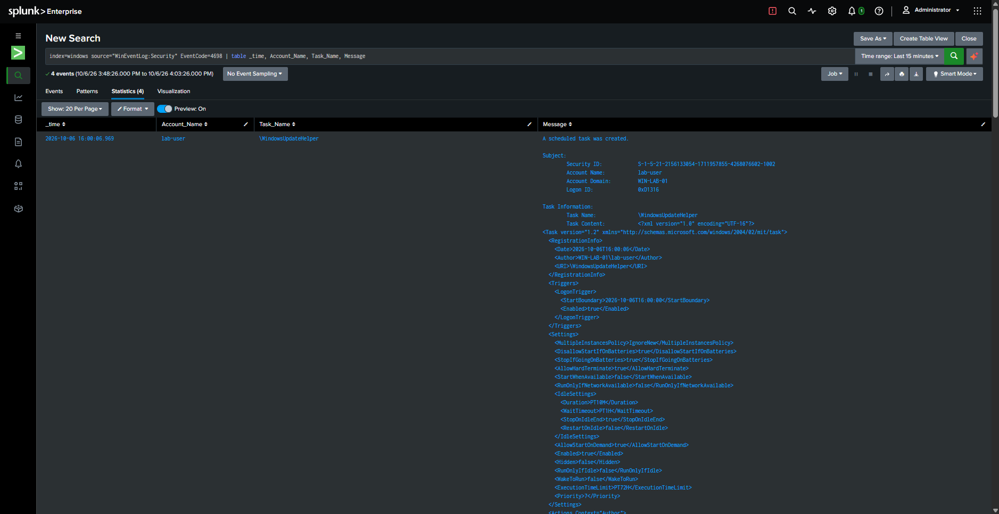
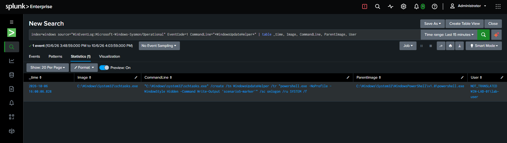
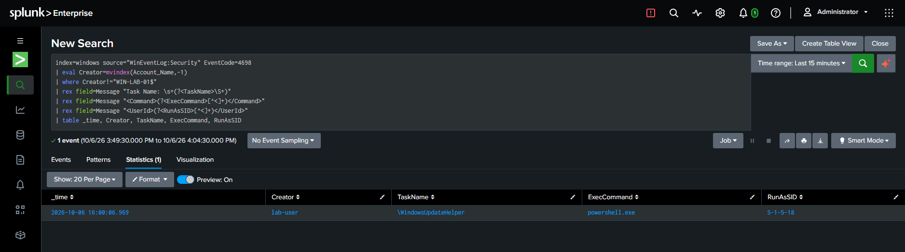

# Detection: Persistence via Scheduled Task

| Field | Value |
|---|---|
| **Name** | Scheduled Task Created by a Human User Account |
| **Purpose** | Detect scheduled tasks created outside of routine OS/update maintenance — a common persistence mechanism |
| **Data source** | Security 4698 (scheduled task created); Sysmon Event ID 1 (`schtasks.exe` process activity) |
| **MITRE ATT&CK** | T1053.005 (Scheduled Task/Job: Scheduled Task) |

## Detection Logic

Scheduled task creation is extremely common on an idle Windows host due to
routine Windows Update orchestration — all created by the machine account
(`<HOSTNAME>$`). Filtering those out leaves only tasks created by actual
human user accounts, a much smaller and more reviewable set.

```spl
index=windows source="WinEventLog:Security" EventCode=4698
| eval Creator=mvindex(Account_Name,-1)
| where Creator!="WIN-LAB-01$"
| rex field=Message "Task Name: \s+(?<TaskName>\S+)"
| rex field=Message "<Command>(?<ExecCommand>[^<]+)</Command>"
| rex field=Message "<UserId>(?<RunAsSID>[^<]+)</UserId>"
| table _time, Creator, TaskName, ExecCommand, RunAsSID
```

## Expected Result

One row per human-created task, showing who created it, the task name, the
command it will execute, and the SID it is configured to run as. A task
created by a standard user but configured to **run as SYSTEM**
(`RunAsSID = S-1-5-18`) is a privilege-escalation-via-persistence pattern
worth immediate review.

## False Positives

Legitimate software installers and IT automation scripts create scheduled
tasks under a human user's session (e.g., a user manually installing
software that registers an update checker). The `RunAsSID` field and task
naming/path convention help distinguish: legitimate Microsoft tasks live
under structured folder paths (e.g.,
`\Microsoft\Windows\UpdateOrchestrator\...`); ad-hoc or malicious tasks are
frequently dropped at the root (e.g., `\WindowsUpdateHelper`) despite using
a name designed to look like a legitimate Microsoft task.

## Investigation Steps

1. Confirm the `Creator` is authorized to create scheduled tasks on this
   host.
2. Compare the task name and path against known legitimate task naming
   conventions (folder structure, vendor prefix).
3. Inspect the `ExecCommand` for suspicious actions (PowerShell with
   `-WindowStyle Hidden`, encoded commands, unusual binaries).
4. Check the trigger type (`LogonTrigger`, `TimeTrigger`, etc.) — a logon
   trigger maximizes persistence across reboots and is a common attacker
   choice.
5. If `RunAsSID` indicates a higher privilege level than the creating
   account held, treat this as a privilege escalation attempt.

## Recommended Response

Delete the unauthorized scheduled task (`schtasks /delete /tn <name> /f`),
review what the task's action has already executed (if the trigger has
fired), and audit the creating account for compromise.

## Validation Notes

Baseline captured organically: three legitimate Windows Update tasks
(`Reboot_AC`, `Reboot_Battery`, `MusUx_LogonUpdateResults`), all created by
the machine account under `\Microsoft\Windows\UpdateOrchestrator\`, with
actions pointing to `MusNotification.exe`.

Simulated incident: a task named `WindowsUpdateHelper` (intentionally
mimicking legitimate naming) created by `lab-user`, registered at the root
of the task namespace (not under a structured folder, unlike every
legitimate task observed), with a `LogonTrigger` and an action of
`powershell.exe -WindowStyle Hidden -Command ...`. Despite being created by
a standard user account, the task's `<Principal><UserId>` was set to
`S-1-5-18` (SYSTEM) via the `/ru SYSTEM` flag — the creation event
correctly attributed the human creator while the task itself was configured
to execute with SYSTEM privileges on next logon, a genuine
privilege-escalation-via-persistence pattern.

## Evidence


*Three legitimate `UpdateOrchestrator` tasks created by the machine account, next to the simulated `WindowsUpdateHelper` task created by `lab-user`.*


*The full `/create ... /ru SYSTEM` command line — a standard user creating a task configured to run as SYSTEM.*


*Filtering out the machine-account noise leaves exactly one reviewable row: creator, task name, command, and the privilege it's configured to run as.*
