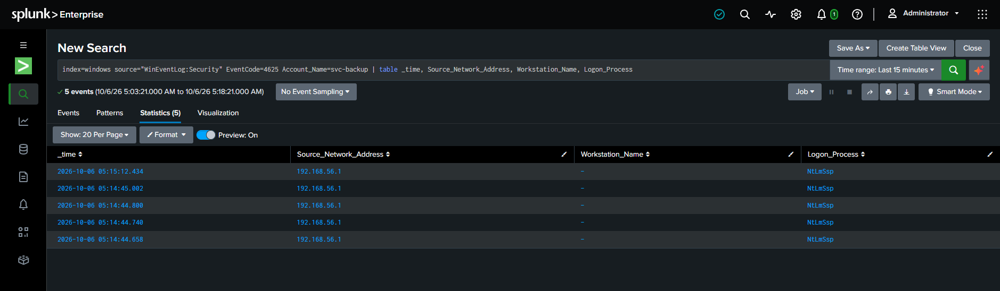
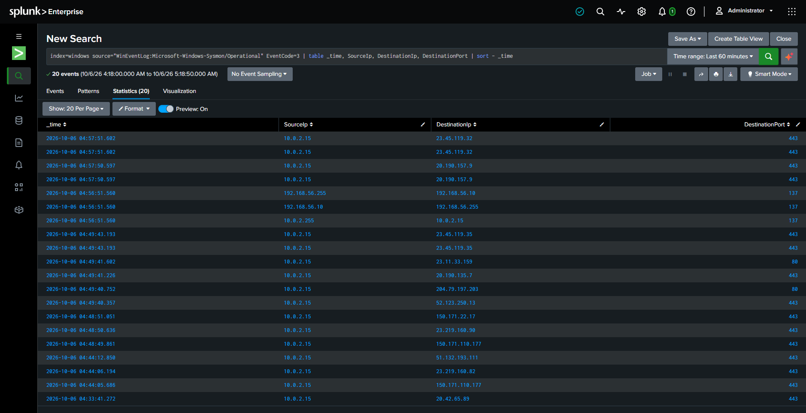

==================================================
INCIDENT REPORT
==================================================

Incident ID:        INC-001
Title:               Brute-Force Authentication Against Local Account (svc-backup)
Severity:            Medium
Status:              Closed
Affected Host:       WIN-LAB-01 (192.168.56.10)
Affected Account:    svc-backup (local, standard privileges)
Detection:           Multiple Failed Logons Followed by Success
Analyst:             lab-user

--------------------------------------------------
SUMMARY
--------------------------------------------------

A simulated external host (Kali Linux, 192.168.56.20) performed four
failed SMB authentication attempts against the local account
`svc-backup`, followed by one successful authentication approximately
36 seconds after the last failure. The activity was generated as a
controlled test using NetExec (nxc) to validate detection coverage for
brute-force / credential-guessing attacks (MITRE ATT&CK T1110).

--------------------------------------------------
TIMELINE
--------------------------------------------------

05:14:44.658  - Failed logon attempt #1 (4625) - svc-backup
05:14:44.740  - Failed logon attempt #2 (4625) - svc-backup
05:14:44.800  - Failed logon attempt #3 (4625) - svc-backup
05:14:45.002  - Failed logon attempt #4 (4625) - svc-backup
05:15:12.434  - Failed logon attempt #5 (4625) - svc-backup
05:15:48.888  - Successful logon (4624) - svc-backup
05:16:xx      - Detection query run; pattern confirmed
05:2x:xx      - Analyst began investigation (this report)
05:3x:xx      - Incident closed (controlled test, no remediation required
                beyond standard response actions, see below)

Note: the first four failures occurred within 0.4 seconds of each
other, consistent with an automated tool submitting a password list
rather than a human typing. The fifth failure occurred ~27 seconds
later and the success followed ~36 seconds after that, which is
consistent with NetExec's default per-attempt delay/retry behavior.

--------------------------------------------------
EVIDENCE
--------------------------------------------------

Event IDs:           4625 (x5), 4624 (x1)
Account targeted:    svc-backup
Logon Type:          3 (Network)
Logon Process:       NtLmSsp (NTLM authentication)
Source_Network_Address (as logged): 192.168.56.1
Workstation_Name (as logged):       - (blank)
True attack source (corroborated via lab network configuration and
attacker-side command history): 192.168.56.20 (Kali Linux VM)

Detection query (see spl/authentication.spl):

  index=windows source="WinEventLog:Security" EventCode=4625
  | eval user=mvindex(Account_Name,-1)
  | bucket _time span=5m
  | stats count as fail_count, earliest(_time) as first_fail,
          latest(_time) as last_fail by user, _time
  | where fail_count >= 3
  | join user [
      search index=windows source="WinEventLog:Security" EventCode=4624
      | eval user=mvindex(Account_Name,-1)
      | eval success_time=_time
      | table user, success_time
    ]
  | where success_time > last_fail AND success_time < last_fail + 300
  | table user, fail_count, first_fail, last_fail, success_time

Result: 1 row returned - user=svc-backup, fail_count=4-5 depending on
bucket boundary, success_time ~36s after last_fail. See
screenshots/28-brute-force-detection.png.

--------------------------------------------------
TELEMETRY FINDINGS (IMPORTANT - affects attribution confidence)
--------------------------------------------------

1. Source IP attribution limitation
   Security EventCode 4625/4624 for NTLM-authenticated SMB logons
   recorded Source_Network_Address=192.168.56.1 (the Windows host's
   own host-only adapter address) rather than the true attacking
   address (192.168.56.20). Workstation_Name was also blank for every
   event. This is a known limitation of NTLM logon auditing on
   non-domain-joined Windows hosts, not a configuration error in this
   lab. See screenshots/29-source-ip-quirk-sysmon-gap.png.

2. Sysmon network visibility gap
   Sysmon Event ID 3 (Network Connection) was active and logging
   other traffic (outbound HTTPS, local NetBIOS broadcasts) during
   the attack window, but captured zero events for the inbound SMB
   connection on port 445 from the Kali VM. The default
   SwiftOnSecurity configuration does not include file-sharing ports
   in its network connection logging rules.

   Combined impact: in this configuration, Windows Security logs are
   the ONLY source that detected this attack, and even that source
   could not reliably confirm the true origin address. A production
   deployment should either tune Sysmon's <NetworkConnect> rules to
   include ports 139/445/3389/5985, or deploy a network-layer tool
   (Zeek/Suricata) to close this gap. This finding directly supports
   the "add Zeek/Suricata" item in the project's V2 roadmap.

--------------------------------------------------
MITRE ATT&CK
--------------------------------------------------

T1110     - Brute Force
T1110.001 - Brute Force: Password Guessing
T1078     - Valid Accounts (post-compromise use of the account)

Why it maps: the activity matches T1110.001 because a tool submitted
multiple distinct passwords against a single account in rapid
succession. The eventual successful authentication establishes
T1078, since from that point the adversary (simulated) holds valid
credentials and could operate under this account's privileges for
any further activity.

--------------------------------------------------
ANALYST ASSESSMENT
--------------------------------------------------

The pattern is a clear, low-ambiguity brute-force indicator: five
failed authentications for a single local account within ~70 seconds,
followed immediately by a success. The account `svc-backup` is a
standard-privilege local account (not an administrator), which limits
the immediate blast radius, but any successful compromise of a valid
account is a meaningful finding because it grants the adversary a
foothold for further action (lateral movement, data access, or
privilege escalation attempts).

The account's password (`Password123!`) is a weak, commonly-guessed
value. This is assessed as the root cause enabling the simulated
attack's success, rather than any gap in Windows' authentication
mechanism itself.

False positive note: this exact pattern (several 4625s followed by a
4624) can also occur from a legitimate user who mistyped their
password multiple times before succeeding, or from a service/script
retrying a stale credential before it is updated. Analysts should
check Logon Type, the time-of-day against the account owner's normal
behavior, and whether MFA or interactive context (console vs. network
logon) is consistent with expected use before treating every instance
as malicious.

--------------------------------------------------
RECOMMENDED RESPONSE
--------------------------------------------------

1. Reset the svc-backup password to a strong, non-dictionary value
   and enforce a password policy (minimum length, complexity) for all
   local/service accounts.
2. Enable account lockout policy (e.g., lock after 5 failed attempts
   within 10 minutes) to limit the window for password-guessing
   attacks.
3. Review what, if anything, the account did after the successful
   logon (4688 / Sysmon Event ID 1 for the corresponding Logon ID) to
   confirm no further malicious action occurred.
4. Restrict SMB access to this host to only the systems that require
   it (already partially implemented in this lab via a host-scoped
   firewall rule).
5. Tune Sysmon's network connection rules, or deploy a network-layer
   monitoring tool, to close the visibility gap identified above.
6. Consider enabling SMB signing (observed as disabled during this
   test: "signing:False") to reduce the risk of relay-style attacks
   in addition to credential-guessing attacks.

--------------------------------------------------
SCREENSHOT EVIDENCE
--------------------------------------------------

Every failed and successful logon for svc-backup recorded the Windows
host's own address rather than the true attacker IP - a known NTLM
auditing limitation on non-domain-joined hosts (see TELEMETRY FINDINGS
above).

Sysmon Event ID 3 logged 20 other network connections during this exact
window but captured zero events for the inbound SMB traffic from Kali -
the default SwiftOnSecurity configuration excludes file-sharing ports
from network logging.

--------------------------------------------------
VALIDATION
--------------------------------------------------

Detection query re-run after documenting this incident continues to
correctly identify the pattern from the indexed historical events.
Re-running the attack scenario from Kali against a reset svc-backup
password with the correct credential would, in a live environment, be
blocked after account lockout policy is enabled (to be validated once
that control is implemented in a future lab iteration).

==================================================
END OF REPORT
==================================================
