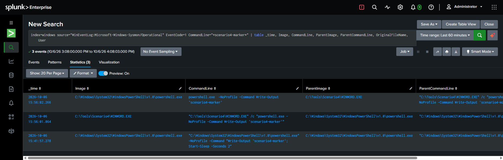
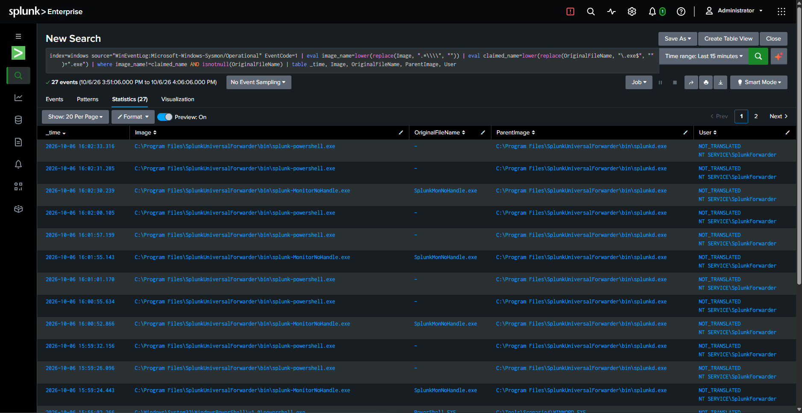
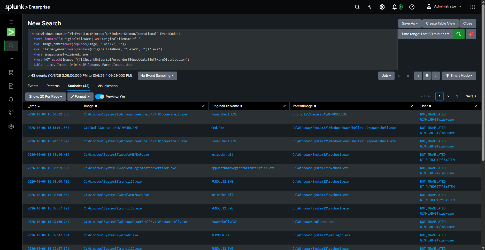
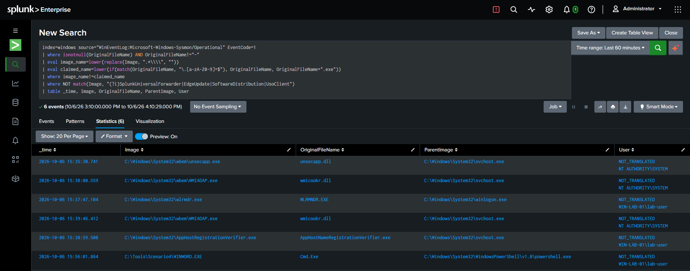
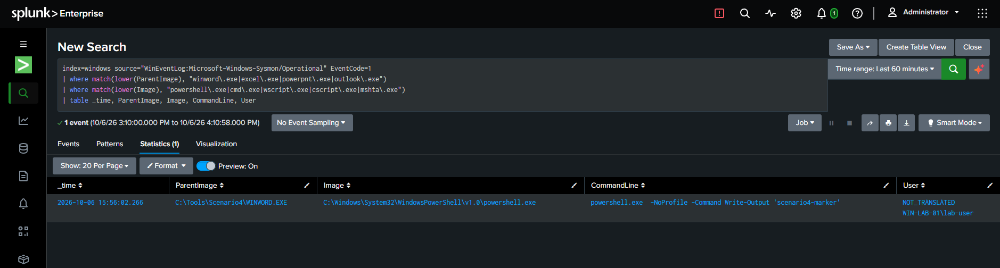

==================================================
INCIDENT REPORT
==================================================

Incident ID:        INC-002
Title:               Masqueraded Binary Spawning PowerShell (Suspicious
                      Parent/Child Process Relationship)
Severity:            Medium-High
Status:              Closed
Affected Host:       WIN-LAB-01 (192.168.56.10)
Affected Account:    lab-user (local, administrator)
Detections:          (1) Binary Identity Masquerading
                      (2) Suspicious Office-to-Shell Parent/Child Relationship
Analyst:             lab-user

--------------------------------------------------
SUMMARY
--------------------------------------------------

A binary was renamed to impersonate a trusted application (WINWORD.EXE,
Microsoft Word) and used to spawn PowerShell as a child process. This
simulates a common real-world initial-access pattern: a malicious document
or a renamed dropper executing a shell or script interpreter under the
guise of a trusted process. Two independent, stackable detections were
developed and validated against this single incident: one targeting the
binary masquerading itself (identity mismatch between filename and
compiled metadata), and one targeting the behavioral pattern (an
Office-class process spawning a shell/script interpreter), regardless of
whether the binary is renamed.

--------------------------------------------------
TIMELINE
--------------------------------------------------

15:41:57.278  - Baseline/control execution: legitimate powershell.exe
                launched directly (no masquerading), used to confirm
                normal process lineage before the simulated incident
15:56:01.864  - C:\Tools\Scenario4\WINWORD.EXE executed (renamed copy of
                cmd.exe; OriginalFileName metadata reads "Cmd.Exe")
                Parent: legitimate powershell.exe (analyst's own session)
15:56:02.266  - Real powershell.exe spawned as a CHILD of
                C:\Tools\Scenario4\WINWORD.EXE
                CommandLine: -NoProfile -Command Write-Output
                'scenario4-marker'
                (analyst-initiated test execution confirmed via marker
                string output)
~16:00:00     - Analyst began investigation and detection-query iteration
~16:05:00     - Detection logic finalized and validated (3 iterations,
                see FALSE POSITIVE ANALYSIS below)
~16:10:00     - Incident closed (controlled test)

--------------------------------------------------
EVIDENCE
--------------------------------------------------

Event IDs:            Sysmon Event ID 1 (Process Creation) x2
Masqueraded binary:    C:\Tools\Scenario4\WINWORD.EXE
  Image (on-disk name): WINWORD.EXE
  OriginalFileName (compiled metadata): Cmd.Exe
  Parent:                powershell.exe (analyst's interactive session)

Child process:         powershell.exe
  Image:                 C:\Windows\System32\WindowsPowerShell\v1.0\powershell.exe
  OriginalFileName:      PowerShell.EXE  (correctly matches - not renamed)
  ParentImage:            C:\Tools\Scenario4\WINWORD.EXE
  CommandLine:            powershell.exe -NoProfile -Command Write-Output
                          'scenario4-marker'
User (both events):     WIN-LAB-01\lab-user

Detection 1 - Binary Identity Masquerading (final, tuned version):

  index=windows source="WinEventLog:Microsoft-Windows-Sysmon/Operational" EventCode=1
  | where isnotnull(OriginalFileName) AND OriginalFileName!="-"
  | eval image_name=lower(replace(Image, ".*\\\\", ""))
  | eval claimed_name=lower(if(match(OriginalFileName, "\.[a-zA-Z0-9]+$"),
          OriginalFileName, OriginalFileName+".exe"))
  | where image_name!=claimed_name
  | where NOT match(Image, "(?i)SplunkUniversalForwarder|EdgeUpdate|SoftwareDistribution|UsoClient")
  | table _time, Image, OriginalFileName, ParentImage, User

  Result: 1 row (WINWORD.EXE / Cmd.Exe) on a 15-minute window. On a wider
  60-minute window, 5 additional legitimate Windows-internal mismatches
  surfaced (see FALSE POSITIVE ANALYSIS).

Detection 2 - Suspicious Office-to-Shell Parent/Child Relationship:

  index=windows source="WinEventLog:Microsoft-Windows-Sysmon/Operational" EventCode=1
  | where match(lower(ParentImage), "winword\.exe|excel\.exe|powerpnt\.exe|outlook\.exe")
  | where match(lower(Image), "powershell\.exe|cmd\.exe|wscript\.exe|cscript\.exe|mshta\.exe")
  | table _time, ParentImage, Image, CommandLine, User

  Result: 1 row, clean on first attempt - no tuning required, since this
  parent/child pairing essentially never occurs legitimately on a
  standard endpoint.

--------------------------------------------------
FALSE POSITIVE ANALYSIS (detailed - this was the core investigative work)
--------------------------------------------------

The masquerading detection (Detection 1) required three iterations to
reach a usable state. This section documents that process, since it is
representative of real detection-engineering work.

Version 1 (first attempt): 17 results in 15 minutes.
  Root causes identified:
  a) Several Splunk Universal Forwarder helper processes
     (splunk-powershell.exe, splunk-netmon.exe, etc.) report
     OriginalFileName as a literal "-" rather than a null/empty value.
     The query's isnotnull() check did not catch this sentinel string,
     so these were incorrectly treated as "has an OriginalFileName" and
     compared.
  b) Legitimate Microsoft installer/update packages intentionally ship
     with an OriginalFileName that differs from their public-facing
     executable name. Observed: a Windows Update component
     (Windows-KB890830-x64-*.exe) with OriginalFileName "mrtstub.exe",
     and a Microsoft Edge updater package with OriginalFileName
     "mini_installer.exe". This is standard, benign packaging practice,
     not malicious activity.

Version 2 (after fix a + b): 2 results.
  Root cause identified:
  c) UsoClient.exe (a Windows Update Session Orchestrator component) has
     an OriginalFileName of "UsoClient" with no file extension. The
     comparison logic assumed every legitimate OriginalFileName would
     include ".exe", so this unmatched and was flagged as a false
     positive.

Version 3 (final): 1 result on the original 15-minute test window - the
  true positive only. Fix: normalize the extension comparison (append
  ".exe" only when OriginalFileName lacks any extension already) and add
  an explicit exclusion for UsoClient alongside the Splunk/Edge/
  SoftwareDistribution exclusions from version 2.

Subsequent validation on a WIDER time window (60 minutes) surfaced 4
additional legitimate mismatches not present in the narrower test window:
unsecapp.exe (OriginalFileName: unsecapp.dll), WMIADAP.exe (wmicookr.dll,
x2), wlrmdr.exe (WLRMNDR.EXE), and AppHostRegistrationVerifier.exe
(AppHostNameRegistrationVerifier.exe). All are legitimate Windows system
components (WMI async callback handler, WMI adapter, the logon reminder
dialog, and an IIS registration verifier) whose compiled internal name
differs from their on-disk filename.

CONCLUSION: filename-vs-metadata mismatch is a real and useful signal, but
it will always have a long tail of legitimate exceptions on a stock
Windows system, because many first-party Windows components are compiled
with internal names that differ from their deployed filename. A
production-grade version of this detection requires either (a) a
maintained allowlist of known-legitimate system binaries/paths, or (b) an
additional corroborating signal - such as an unusual file path (outside
System32/Program Files), an unsigned binary, or an unexpected parent
process - rather than relying on the filename/metadata mismatch in
isolation.

Detection 2 (parent/child relationship) did not require this kind of
tuning, because the pairing it targets (Office applications spawning
shell/script interpreters) essentially does not occur during normal
Windows or application operation. This makes it a notably more precise,
lower-maintenance detection than Detection 1, despite both targeting the
same underlying incident - a useful illustration that behavioral
detections can be more robust than identity/metadata-based ones for some
technique categories.

--------------------------------------------------
SCREENSHOT EVIDENCE
--------------------------------------------------

The two linked Sysmon events: WINWORD.EXE (OriginalFileName: Cmd.Exe)
spawning real powershell.exe as a child process.

First iteration. Sentinel "-" values and legitimate installer renaming
both slipped through the filter.

After excluding known noise sources. UsoClient still false-positives due
to a missing file extension in its compiled metadata.

One true positive on the original 15-minute test window, after
normalizing the extension comparison logic.

The behavioral detection required no tuning, illustrating that
relationship-based detections can be more robust than identity/metadata
comparisons for some technique categories.

--------------------------------------------------
MITRE ATT&CK
--------------------------------------------------

T1036      - Masquerading
T1036.003  - Masquerading: Rename System Utilities
T1059.001  - Command and Scripting Interpreter: PowerShell
T1566      - Phishing (the real-world initial-access vector this scenario
             simulates - a malicious document spawning a shell; not
             directly observed here since no actual document/macro was
             used, but it is the technique this process lineage would
             typically result from)

Why it maps: T1036.003 applies directly, since a copy of cmd.exe was
renamed to WINWORD.EXE specifically to blend in with a trusted,
expected-to-be-present application name. T1059.001 applies because the
ultimate goal of the masquerading was to launch PowerShell. T1566 is noted
as the typical real-world delivery mechanism this pattern would follow
from (a malicious Office document with a macro), though this incident
tested the resulting process lineage directly rather than the delivery
vector itself.

--------------------------------------------------
ANALYST ASSESSMENT
--------------------------------------------------

This incident demonstrates a stronger overall detection posture than a
single-technique finding would: two independent detections, built on
different telemetry attributes (static binary identity vs. dynamic
process relationship), both correctly flag the same incident. This is a
meaningful property, since an attacker capable of defeating one detection
(for example, by not renaming the binary at all) would still be caught by
the other.

The masquerading detection's false-positive journey is, in the analyst's
assessment, the most valuable output of this scenario. It demonstrates
that a plausible-sounding detection idea ("flag when a file's name doesn't
match its internal metadata") requires real iteration against real
endpoint noise before it is usable, and that even the "final" tuned
version has known, documented limitations (the long tail of legitimate
Windows-internal mismatches) that a production deployment would need to
address with an allowlist or additional signals rather than assuming the
rule is complete.

--------------------------------------------------
RECOMMENDED RESPONSE
--------------------------------------------------

1. If a renamed-binary / masquerading execution is confirmed malicious,
   isolate the host immediately and preserve the binary for analysis
   (hash it - Sysmon's Hashes field on Event ID 1 captures this
   automatically).
2. Terminate the spawned child process if still running.
3. Review what the child process (PowerShell, in this case) executed -
   check for 4104 script block content, outbound network connections
   (Sysmon 3), and file writes (Sysmon 11) in the same session.
4. Deploy Detection 2 (parent/child relationship) as the primary,
   higher-confidence alert; use Detection 1 (masquerading) as a
   secondary/enrichment signal given its higher false-positive ceiling.
5. For a production environment, build and maintain an allowlist of
   known-legitimate Windows system binaries with intentional
   OriginalFileName mismatches, to reduce Detection 1's baseline noise
   without discarding its value entirely.
6. Consider application allowlisting (e.g., Windows Defender Application
   Control / AppLocker) as a preventive control, since it would block
   execution of a renamed cmd.exe from a non-standard path
   (C:\Tools\Scenario4\) regardless of detection coverage.

--------------------------------------------------
VALIDATION
--------------------------------------------------

Both final detection queries were re-run after tuning and confirmed to
return exactly one true-positive row each, with Detection 1's known
limitations (legitimate Windows-internal mismatches) explicitly documented
rather than silently suppressed, so future analysts reviewing this
detection understand its tuning history and residual false-positive
surface.

==================================================
END OF REPORT
==================================================
